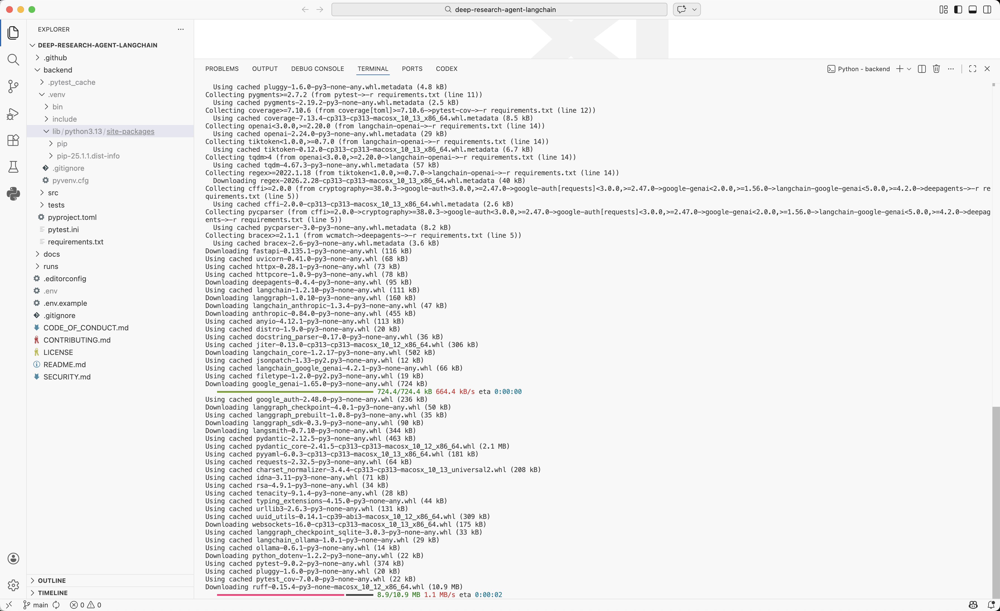
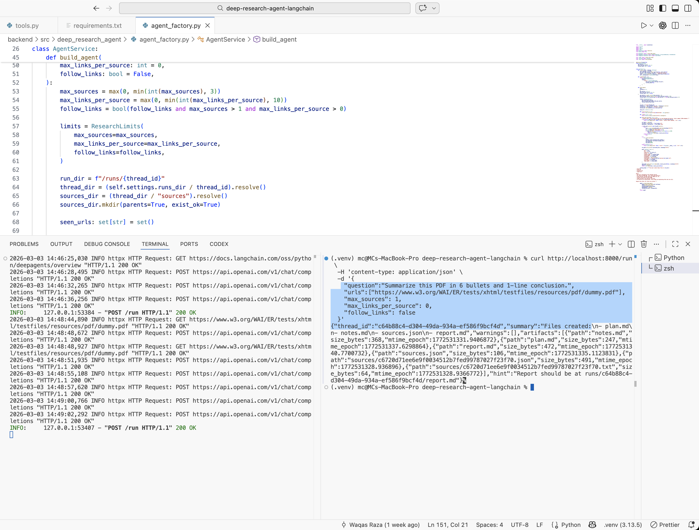
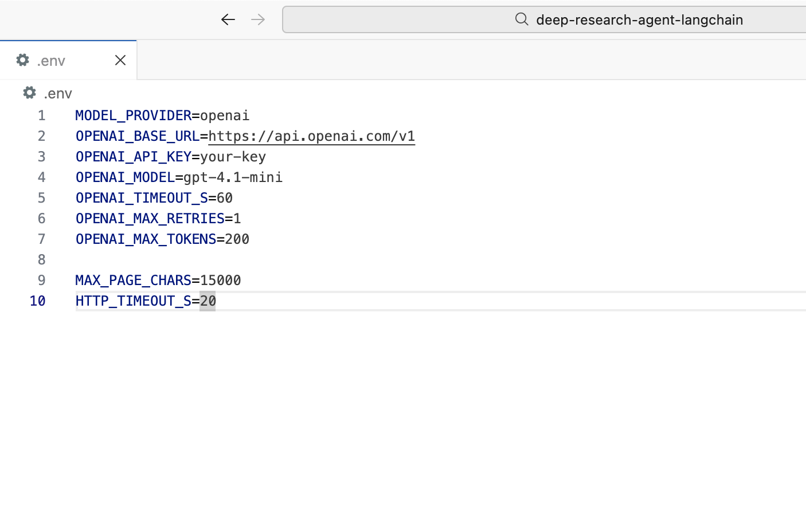
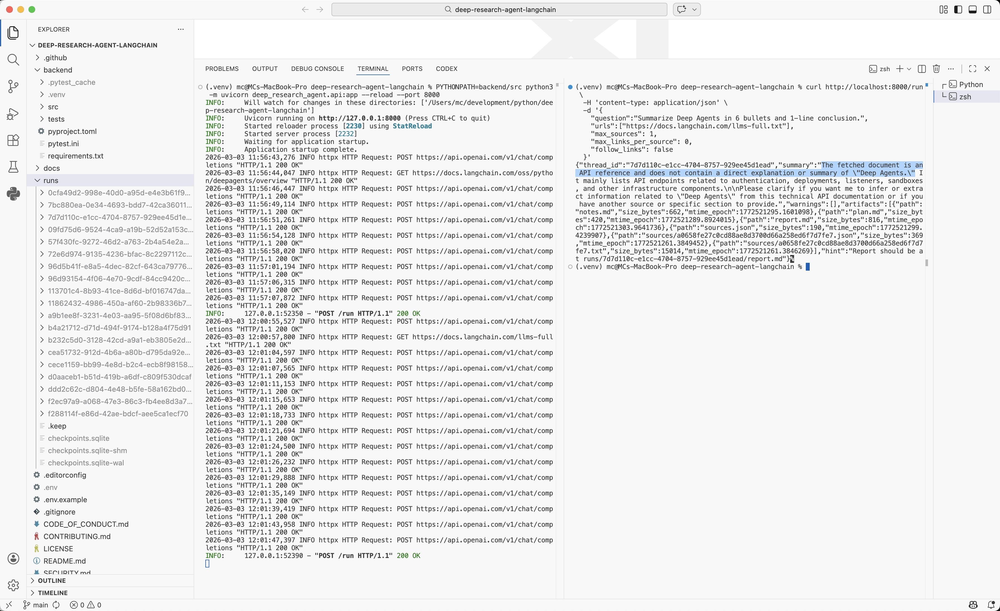

# Deep Research Agent (Deep Agents + LangGraph)

A production-grade research agent that:

- Creates a plan
- Reads sources you provide
- Produces artifacts (plan, notes, sources.json, report.md)
- Stores fetched sources under `runs/<thread_id>/sources`
- Keeps everything traceable and easy to review

### Screenshots

   

[](https://github.com/waqasraza123/deep-research-agent-langchain/actions/workflows/ci.yml)

## Supported source links

The fetcher supports:

- HTML pages (with robust extraction + fallback for JS-rendered docs)
- Direct document links (top 5 common formats):
  - `.pdf`
  - `.docx`
  - `.txt`
  - `.md`
  - `.csv`

If a link ends in one of these extensions (e.g. `https://example.com/file.pdf`), it will be fetched and extracted as a document instead of HTML.

## Outputs

Each run produces:

- `runs/<thread_id>/plan.md`
- `runs/<thread_id>/notes.md`
- `runs/<thread_id>/sources.json`
- `runs/<thread_id>/report.md`
- `runs/<thread_id>/sources/*.txt`
- `runs/<thread_id>/sources/*.json`

## Demo

A sample output set is included under:

- `docs/demo/plan.md`
- `docs/demo/notes.md`
- `docs/demo/sources.json`
- `docs/demo/report.md`

## Guardrails

- Request caps: `max_sources` is clamped to 0–3, `max_links_per_source` to 0–10
- Default safe mode: `max_sources=1` and `follow_links=false`
- Fetch limits: `MAX_PAGE_CHARS` caps extracted content before it is stored
- Model limits: `OPENAI_MAX_TOKENS` caps response size per model call
- Timeouts: `HTTP_TIMEOUT_S` for fetches, `OPENAI_TIMEOUT_S` for model calls
- Retries: `OPENAI_MAX_RETRIES` is capped to a small value
- Artifact completion: if `report.md` is missing after a run, the service generates it once using a tool-free model call, then falls back to a deterministic report

## Requirements

- Python 3.11+

## Quickstart (OpenAI, recommended)

1. Create `.env` in the repo root:

MODEL_PROVIDER=openai
OPENAI_BASE_URL=https://api.openai.com/v1
OPENAI_API_KEY=your_key_here
OPENAI_MODEL=gpt-4.1-mini
OPENAI_TIMEOUT_S=60
OPENAI_MAX_RETRIES=1
OPENAI_MAX_TOKENS=350

MAX_PAGE_CHARS=15000
HTTP_TIMEOUT_S=20

````

2. Install and run backend:

```bash
python3 -m venv backend/.venv
source backend/.venv/bin/activate
pip install -r backend/requirements.txt
pip install -e backend
uvicorn deep_research_agent.api:app --reload --port 8000
````

3. Test (HTML page):

```bash
curl http://localhost:8000/run \
  -H 'content-type: application/json' \
  -d '{
    "question":"Summarize Deep Agents in 6 bullets and 1-line conclusion.",
    "urls":["https://docs.langchain.com/oss/python/deepagents/overview"],
    "max_sources": 1,
    "max_links_per_source": 0,
    "follow_links": false
  }'
```

4. Test (PDF link):

```bash
curl http://localhost:8000/run \
  -H 'content-type: application/json' \
  -d '{
    "question":"Summarize this PDF in 6 bullets and 1-line conclusion.",
    "urls":["https://www.w3.org/WAI/ER/tests/xhtml/testfiles/resources/pdf/dummy.pdf"],
    "max_sources": 1,
    "max_links_per_source": 0,
    "follow_links": false
  }'
```

Then open:

```bash
runs/<thread_id>/report.md
runs/<thread_id>/sources.json
```

## Optional local: Ollama

1. Run Ollama:

```bash
brew install ollama
ollama serve
ollama pull llama3.1
```

2. Set `.env`:

```bash
MODEL_PROVIDER=ollama
OLLAMA_MODEL=llama3.1
OLLAMA_NUM_PREDICT=220

MAX_PAGE_CHARS=15000
HTTP_TIMEOUT_S=20
```

3. Run backend:

```bash
source backend/.venv/bin/activate
uvicorn deep_research_agent.api:app --reload --port 8000
```

## Dependencies for document extraction

- PDF: `pypdf`
- DOCX: `python-docx`

Install via:

```bash
source backend/.venv/bin/activate
pip install pypdf python-docx
```

## API

```text
GET /health
POST /run
GET /threads/{thread_id}/artifacts
GET /threads/{thread_id}/artifacts/{path}
```

## Notes

```text
runs/ is not committed (except runs/.keep)

For quick validation runs: max_sources=1 and follow_links=false

Model availability depends on your account and verification status
```
