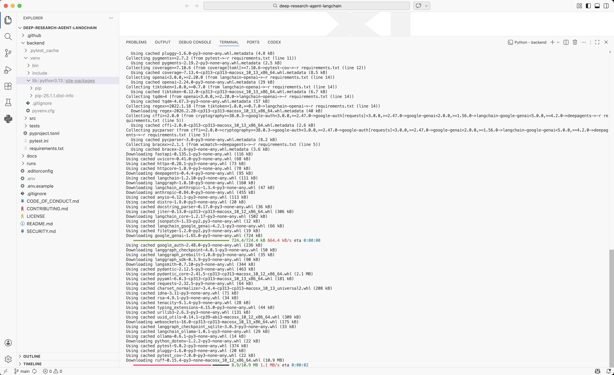
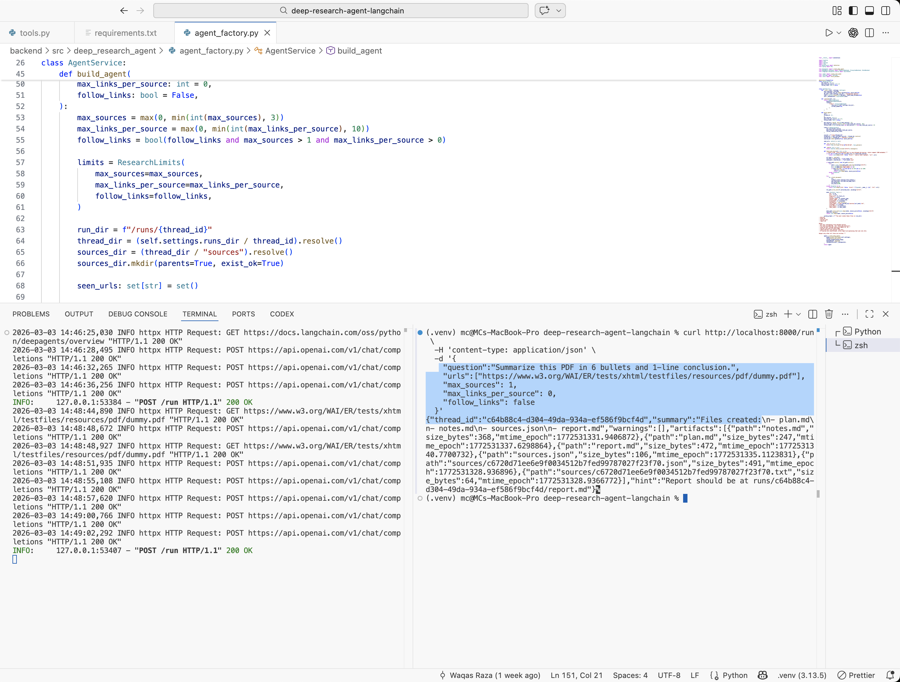
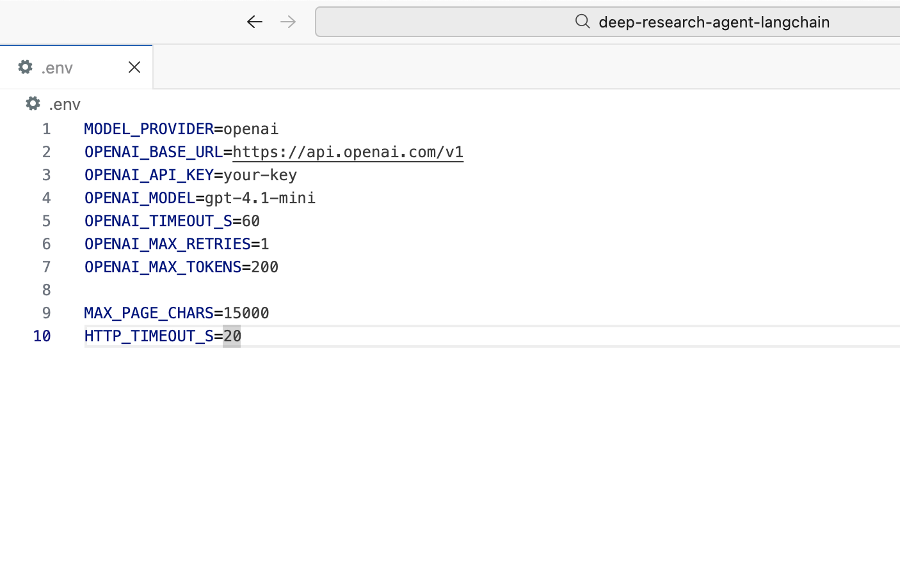
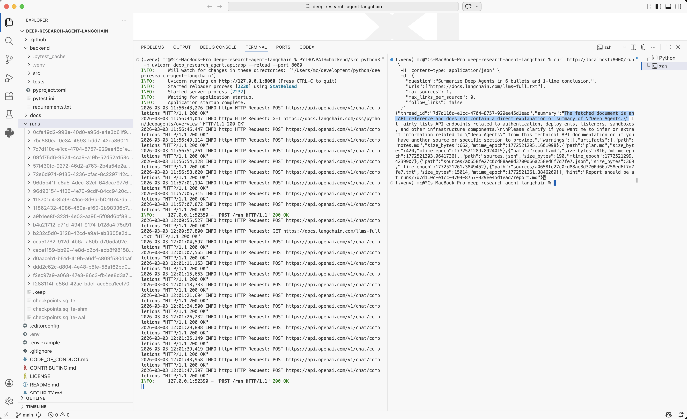

# Deep Research Agent (Deep Agents + LangGraph)

A production-grade research agent that:

- Creates a plan
- Builds a deterministic research strategy before agent execution
- Reads sources you provide
- Produces artifacts (plan, notes, sources.json, report.md)
- Stores fetched sources under `runs/<thread_id>/sources`
- Keeps everything traceable and easy to review

### Screenshots

   

[](https://github.com/waqasraza123/deep-research-agent-langchain/actions/workflows/ci.yml)

## Supported source links

The fetcher supports:

- HTML pages (with robust extraction + fallback for JS-rendered docs)
- Direct document links (top 5 common formats):
  - `.pdf`
  - `.docx`
  - `.txt`
  - `.md`
  - `.csv`

If a link ends in one of these extensions (e.g. `https://example.com/file.pdf`), it will be fetched and extracted as a document instead of HTML.

## Outputs

Each run produces:

- `runs/<thread_id>/strategy.json`
- `runs/<thread_id>/strategy.md`
- `runs/<thread_id>/subquestions.json`
- `runs/<thread_id>/verification_plan.md`
- `runs/<thread_id>/plan.md`
- `runs/<thread_id>/notes.md`
- `runs/<thread_id>/sources.json`
- `runs/<thread_id>/source_graph.json`
- `runs/<thread_id>/source_graph.md`
- `runs/<thread_id>/report.md`
- `runs/<thread_id>/sources/*.txt`
- `runs/<thread_id>/sources/*.json`

The backend also builds deterministic evidence review artifacts after `report.md` exists:

- `runs/<thread_id>/evidence_ledger.json`
- `runs/<thread_id>/evidence_ledger.md`
- `runs/<thread_id>/unsupported_claims.md`
- `runs/<thread_id>/contradictions.md`
- `runs/<thread_id>/citation_map.json`
- `runs/<thread_id>/evidence_coverage.json`

The evidence layer is offline and heuristic-driven. It extracts candidate claims from
`notes.md`, `report.md`, and fetched source text, then scores source citations using phrase,
keyword, entity, numeric/date, title, and domain overlap. It flags unsupported claims,
possible contradictions, and confidence penalties for audit. These artifacts are review aids,
not proof of truth: low-confidence matches, broad claims, stale date-sensitive statements, and
detected contradictions should be checked by a human before relying on the report.

## Safe Source Expansion

`POST /run` supports bounded one-hop source expansion with:

- `follow_links`: defaults to `false`. When false, only the root URLs are fetched.
- `max_links_per_source`: defaults to `0` and is clamped to `0-10`.

When enabled, the backend fetches root URLs first, extracts links from successful HTML and
Markdown sources, normalizes and validates candidates, ranks useful research links, and then
fetches only the highest-value candidates within both per-source and global crawl budgets.
Expansion is intentionally limited to one depth.

The crawler rejects unsafe or low-value links before fetching where possible, including
local/private hosts, unsupported schemes, binary media assets, login/signup/pricing/legal
pages, social links, and duplicate URLs. Redirect targets are still validated by the same
fetch layer used for root sources.

`sources.json` remains the primary source manifest and marks each entry with `source_kind`,
`parent_url`, `crawl_depth`, `quality_score`, and skipped/duplicate metadata.
`source_graph.json` and `source_graph.md` provide the operator-facing crawl graph, skipped
reasons, parent-child relationships, dedupe relationships, quality scores, and budget usage.

## Demo

A sample output set is included under:

- `docs/demo/plan.md`
- `docs/demo/notes.md`
- `docs/demo/sources.json`
- `docs/demo/report.md`

## Guardrails

- Request caps: `max_sources` is clamped to 0–3, `max_links_per_source` to 0–10
- Default safe mode: `max_sources=1` and `follow_links=false`
- Planning is deterministic and works without model credentials
- Source expansion: one-hop only, with per-source and global crawl budgets
- Fetch limits: `MAX_PAGE_CHARS` caps extracted content before it is stored
- Model limits: `OPENAI_MAX_TOKENS` caps response size per model call
- Timeouts: `HTTP_TIMEOUT_S` for fetches, `OPENAI_TIMEOUT_S` for model calls
- Retries: `OPENAI_MAX_RETRIES` is capped to a small value
- Runtime budgets: every run persists `budget.json` with model call, source fetch, generated character, runtime, artifact size, and crawl expansion usage
- Event trace: every run persists `events.jsonl` and `events.md` for operator review
- Artifact completion: if `report.md` is missing after a run, the service generates it once using a tool-free model call, then falls back to a deterministic report

## Offline mock mode

Use mock mode for CI, local smoke tests, and orchestration checks without OpenAI credentials or a local Ollama server:

```bash
MODEL_PROVIDER=mock
```

Or request it per run:

```bash
curl http://localhost:8000/run \
  -H 'content-type: application/json' \
  -d '{"question":"Validate the runtime flow.", "mock_mode": true}'
```

Mock mode is deterministic and writes clearly marked mock artifacts: `plan.md`, `notes.md`, `sources.json`, `report.md`, and `metadata.json`. It does not silently replace production model failures. Mock fallback only runs when `ALLOW_MOCK_FALLBACK=true` or `allow_mock_fallback=true` is explicitly set on the request.

## Requirements

- Python 3.11+

## Quickstart (OpenAI, recommended)

1. Create `.env` in the repo root:

MODEL_PROVIDER=openai
OPENAI_BASE_URL=https://api.openai.com/v1
OPENAI_API_KEY=your_key_here
OPENAI_MODEL=gpt-4.1-mini
OPENAI_TIMEOUT_S=60
OPENAI_MAX_RETRIES=1
OPENAI_MAX_TOKENS=350

MAX_PAGE_CHARS=15000
HTTP_TIMEOUT_S=20

````

2. Install and run backend:

```bash
python3 -m venv backend/.venv
source backend/.venv/bin/activate
pip install -r backend/requirements.txt
pip install -e backend
uvicorn deep_research_agent.api:app --reload --port 8000
````

3. Test (HTML page):

```bash
curl http://localhost:8000/run \
  -H 'content-type: application/json' \
  -d '{
    "question":"Summarize Deep Agents in 6 bullets and 1-line conclusion.",
    "urls":["https://docs.langchain.com/oss/python/deepagents/overview"],
    "max_sources": 1,
    "max_links_per_source": 0,
    "follow_links": false
  }'
```

4. Test (PDF link):

```bash
curl http://localhost:8000/run \
  -H 'content-type: application/json' \
  -d '{
    "question":"Summarize this PDF in 6 bullets and 1-line conclusion.",
    "urls":["https://www.w3.org/WAI/ER/tests/xhtml/testfiles/resources/pdf/dummy.pdf"],
    "max_sources": 1,
    "max_links_per_source": 0,
    "follow_links": false
  }'
```

Then open:

```bash
runs/<thread_id>/report.md
runs/<thread_id>/sources.json
```

## Optional local: Ollama

1. Run Ollama:

```bash
brew install ollama
ollama serve
ollama pull llama3.1
```

2. Set `.env`:

```bash
MODEL_PROVIDER=ollama
OLLAMA_MODEL=llama3.1
OLLAMA_NUM_PREDICT=220

MAX_PAGE_CHARS=15000
HTTP_TIMEOUT_S=20
```

3. Run backend:

```bash
source backend/.venv/bin/activate
uvicorn deep_research_agent.api:app --reload --port 8000
```

## Dependencies for document extraction

- PDF: `pypdf`
- DOCX: `python-docx`

Install via:

```bash
source backend/.venv/bin/activate
pip install pypdf python-docx
```

## API

```text
GET /health
GET /models
GET /runtime/diagnostics
POST /research-plan
POST /plan
POST /run
GET /runs
GET /runs/{thread_id}
POST /runs/{thread_id}/cancel
GET /runs/{thread_id}/review
POST /runs/{thread_id}/review/approve
POST /runs/{thread_id}/review/request-changes
POST /runs/{thread_id}/review/reject
GET /runs/cleanup/plan
POST /runs/cleanup/apply
GET /runs/{thread_id}/events
GET /runs/{thread_id}/budget
POST /runs/{thread_id}/evidence/rebuild
GET /threads/{thread_id}/artifacts
GET /threads/{thread_id}/artifacts/{path}
```

`POST /research-plan` and `POST /plan` create a typed research strategy without
running the full agent. `POST /run` generates the same planning artifacts by
default before source fetching and agent execution; pass `"generate_strategy":
false` to skip that step.

`GET /models` reports configured provider capabilities for OpenAI-compatible,
llama.cpp, Ollama, and mock providers. `GET /runtime/diagnostics` summarizes the
active provider, mock fallback state, default budgets, and configuration warnings.

## Run Lifecycle

Every `/run` request creates a JSON registry record at `runs/<thread_id>/.run.json`.
The registry tracks the input snapshot, status, stage, artifact names, warnings,
errors, budget summary when present, review metadata, and an artifact-derived resume
point.

Statuses are explicit:

```text
created -> planning -> fetching_sources -> analyzing -> writing_report -> building_evidence
```

From `building_evidence`, a run moves to `completed` by default or
`waiting_for_review` when `/run` is called with `"require_review": true`. Any active
state can move to `failed` or `cancelled`; invalid transitions are rejected.

Operators can list concise run summaries:

```bash
curl 'http://localhost:8000/runs?status=completed'
curl 'http://localhost:8000/runs?has_errors=true'
curl 'http://localhost:8000/runs?review_status=changes_requested'
```

Review workflow:

```bash
curl http://localhost:8000/runs/<thread_id>/review
curl -X POST http://localhost:8000/runs/<thread_id>/review/request-changes \
  -H 'content-type: application/json' \
  -d '{"reviewer":"operator","notes":"Needs better citations","requested_changes":["Add source quotes"]}'
curl -X POST http://localhost:8000/runs/<thread_id>/review/approve \
  -H 'content-type: application/json' \
  -d '{"reviewer":"operator","notes":"Approved"}'
```

Cancellation is cooperative:

```bash
curl -X POST http://localhost:8000/runs/<thread_id>/cancel \
  -H 'content-type: application/json' \
  -d '{"requested_by":"operator","reason":"No longer needed"}'
```

The backend writes a cancellation marker and checks it between major stages. It cannot
interrupt an in-flight synchronous `agent.invoke()` call.

Resumability is artifact-driven. The backend reports resume points such as
`after_planning`, `after_source_fetching`, `after_agent_analysis`,
`after_report_writing`, and `after_evidence_building` from files already present on
disk. This does not claim full LangGraph checkpoint recovery yet.

Cleanup is opt-in only. `GET /runs/cleanup/plan` identifies stale incomplete runs and
oversized run directories. `POST /runs/cleanup/apply` deletes only when
`confirm_delete` is explicitly `true`; the service never auto-deletes artifacts.

## Notes

```text
runs/ is not committed (except runs/.keep)

For quick validation runs: max_sources=1 and follow_links=false

Model availability depends on your account and verification status
```
